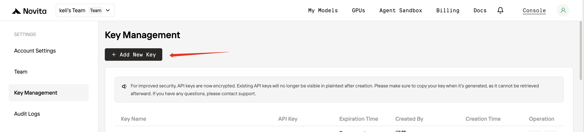

## Overview

[Novita AI](https://novita.ai/) is an AI cloud platform that helps developers easily deploy AI models through a simple API, backed by affordable and reliable GPU cloud infrastructure.

Novita AI supports various models from DeepSeek, Llama, Qwen, GLM, etc. Check all models [here](https://novita.ai/models/llm).

# Configuration

1. [Create a Novita AI account.](https://novita.ai/user/login)
2. Create and save your API key [here](https://novita.ai/settings/key-management).
   - Click **Add New Key** to generate a new API Key. Note that the key **will only be displayed once upon generation** — ensure to save it in a safe place.
     

3. Install the plugin in Dify, access the [Settings] page to enter the API key you just created. 

4. Now you can use the Novita AI models in Dify.

Source code of this plugin: [https://github.com/novitalabs/dify-plugin-novita](https://github.com/novitalabs/dify-plugin-novita)
