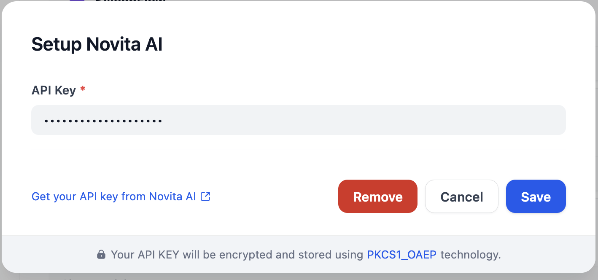

## Overview

[Novita AI](https://novita.ai/) is an AI cloud platform that helps developers easily deploy AI models through a simple API, backed by affordable and reliable GPU cloud infrastructure.

Novita AI supports various models from DeepSeek, Llama, Qwen, etc. Check all models [here](https://novita.ai/models/llm).

## Configure
After installation, you need to get API keys from [Novita AI](https://novita.ai/settings/key-management?utm_source=github_dify) and setup in Settings -> Model Provider.

Source code of this plugin: [https://github.com/novitalabs/dify-plugin-novita](https://github.com/novitalabs/dify-plugin-novita)
